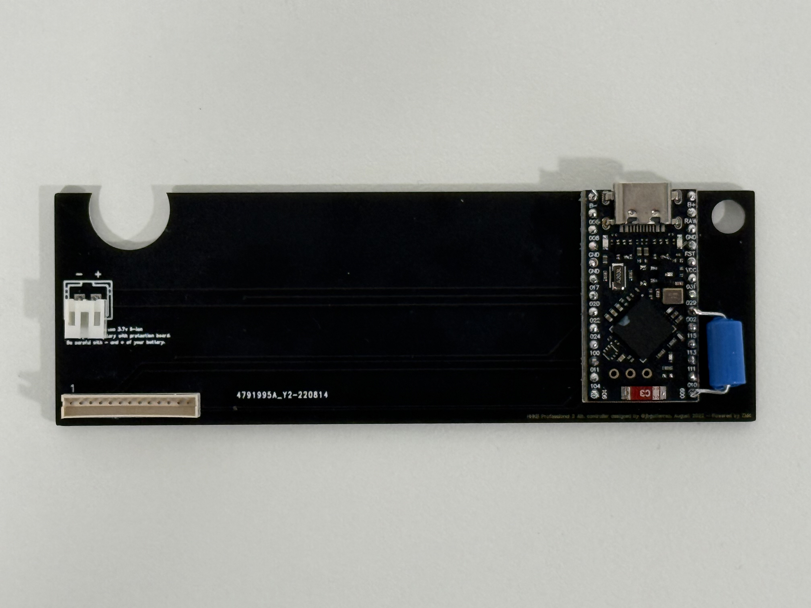

# HHKB Pro 2 with ZMK firmware

This project provides an out-of-tree Zephyr module and shield definition for the HHKB Pro2 daugther board.

Power saving is enabled by default, so the keyboard will enter deep sleep after 
5 minutes of inactivity. The keyboard will wake up whenever button or vibration sensor is pressed or movement is detected. PINs 19 and 10 are used for that.

The `hhkb_pro2` shield defines the default HHKB keymap and `zmk,kscan` chosen. Any board can use the `hhkb_pro2` shield by defining the `hhkb_pro2_connector` gpio nexus node. Examples can be find in [custom_pro2.overlay](config/boards/shields/custom_pro2/custom_pro2.overlay) and [whkb_pro2.dts](config/boards/arm/whkb_pro2/whkb_pro2.dts).

Just fork this repository, enable Github Actions in the forked repository, and push your changes. The firmware will be built upon each push and the firmware will be available in the Actions tab.

To flash the firmware, you can short reset and ground pins on the Nice!Nano (or any other nRF52840 board) and drag and drop the firmware file to the USB mass storage device that will appear.

## Acknowledgements

This is just a fork of the original work by kanru. Head over to his repository to see the original work:

https://github.com/kanru/hhkb-zmk
