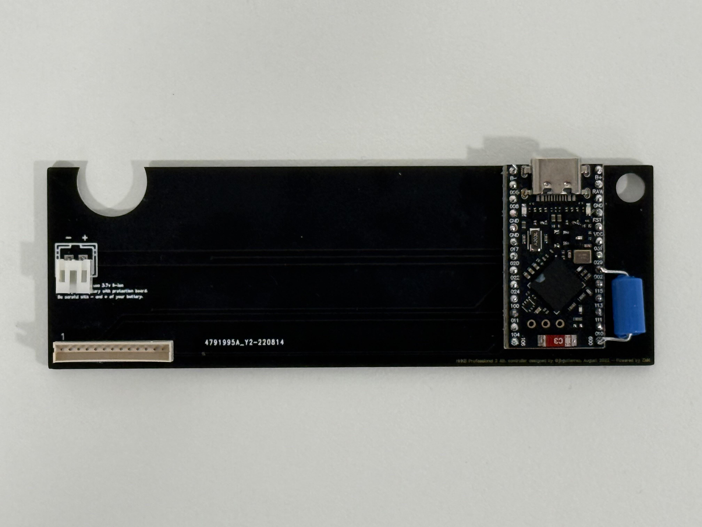

# HHKB Pro 2 with ZMK firmware

[](https://github.com/jbgutierrez/hhkb-zmk/actions/workflows/build.yml)

This project provides an out-of-tree Zephyr module and shield definition for the HHKB Pro2 daughter board.

The `hhkb_pro2` shield defines the default HHKB keymap and `zmk,kscan` chosen. Any board can use the `hhkb_pro2` shield by defining the `hhkb_pro2_connector` gpio nexus node. Examples can be found in [custom_pro2.overlay](config/boards/shields/custom_pro2/custom_pro2.overlay) and [whkb_pro2.dts](config/boards/arm/whkb_pro2/whkb_pro2.dts).



## Features

- ZMK Studio support for real-time keymap editing
- Bluetooth LE with +8 dBm TX power for extended range
- Deep sleep after 5 minutes of inactivity (wakes on button press or vibration sensor via PINs 19 and 10)
- Battery level reporting every 30 minutes
- USB and BLE output toggle
- 3 layers: Default, Fn, and Bluetooth

## Keymap

### Layer 0 — Default

```
┌─────┬─────┬─────┬─────┬─────┬─────┬─────┬─────┬─────┬─────┬─────┬─────┬─────┬─────┬─────┐
│ Esc │  1  │  2  │  3  │  4  │  5  │  6  │  7  │  8  │  9  │  0  │  -  │  =  │  \  │  `  │
├─────┴──┬──┴──┬──┴──┬──┴──┬──┴──┬──┴──┬──┴──┬──┴──┬──┴──┬──┴──┬──┴──┬──┴──┬──┴──┬──┴─────┤
│  Tab   │  Q  │  W  │  E  │  R  │  T  │  Y  │  U  │  I  │  O  │  P  │  [  │  ]  │  Bksp  │
├────────┴┬────┴┬────┴┬────┴┬────┴┬────┴┬────┴┬────┴┬────┴┬────┴┬────┴┬────┴┬────┴────────┤
│  Ctrl   │  A  │  S  │  D  │  F  │  G  │  H  │  J  │  K  │  L  │  ;  │  '  │    Enter    │
├─────────┴──┬──┴──┬──┴──┬──┴──┬──┴──┬──┴──┬──┴──┬──┴──┬──┴──┬──┴──┬──┴──┬──┴─────┬───────┤
│   Shift    │  Z  │  X  │  C  │  V  │  B  │  N  │  M  │  ,  │  .  │  /  │ Shift  │  Fn   │
└──────┬─────┴┬────┴─────┴─────┴─────┴─────┴─────┴─────┴─────┴────┬┴─────┼────────┴───────┘
       │ Alt  │  Gui  │             Space             │  Gui  │ Alt │
       └──────┴───────┴───────────────────────────────┴───────┴─────┘
```

### Layer 1 — Fn (hold Fn)

```
┌─────┬─────┬─────┬─────┬─────┬─────┬─────┬─────┬─────┬─────┬─────┬─────┬─────┬─────┬─────┐
│Power│ F1  │ F2  │ F3  │ F4  │ F5  │ F6  │ F7  │ F8  │ F9  │ F10 │ F11 │ F12 │ Ins │ Del │
├─────┴──┬──┴──┬──┴──┬──┴──┬──┴──┬──┴──┬──┴──┬──┴──┬──┴──┬──┴──┬──┴──┬──┴──┬──┴──┬──┴─────┤
│  Caps  │     │     │     │Reset│Studi│     │Boot │PScr │SLck │Paus │  ↑  │     │  Bksp  │
├────────┴┬────┴┬────┴┬────┴┬────┴┬────┴┬────┴┬────┴┬────┴┬────┴┬────┴┬────┴┬────┴────────┤
│  [BT]   │Vol- │Vol+ │Mute │Ejct │     │ KP* │ KP/ │Home │PgUp │  ←  │  →  │             │
├─────────┴──┬──┴──┬──┴──┬──┴──┬──┴──┬──┴──┬──┴──┬──┴──┬──┴──┬──┴──┬──┴──┬──┴─────┬───────┤
│            │     │     │     │     │     │ KP+ │ KP- │ End │PgDn │  ↓  │        │       │
└──────┬─────┴┬────┴─────┴─────┴─────┴─────┴─────┴─────┴─────┴────┬┴─────┼────────┴───────┘
       │      │       │                               │       │     │
       └──────┴───────┴───────────────────────────────┴───────┴─────┘
```

- **Reset** / **Boot**: put the controller into reset / bootloader mode (for flashing)
- **Studi**: unlock ZMK Studio for live keymap editing
- **[BT]**: hold to activate the Bluetooth layer (Layer 2)
- Empty cells (▽) are transparent — they pass through to Layer 0

### Layer 2 — Bluetooth (hold Fn + Ctrl)

```
┌─────┬─────┬─────┬─────┬─────┬─────┬─────┬─────┬─────┬─────┬─────┬─────┬─────┬─────┬─────┐
│O TOG│ BT0 │ BT1 │ BT2 │ BT3 │ BT4 │     │     │     │     │     │     │     │     │     │
├─────┴──┬──┴──┬──┴──┬──┴──┬──┴──┬──┴──┬──┴──┬──┴──┬──┴──┬──┴──┬──┴──┬──┴──┬──┴──┬──┴─────┤
│        │BtClr│     │     │     │     │     │ USB │     │     │     │     │     │        │
├────────┴┬────┴┬────┴┬────┴┬────┴┬────┴┬────┴┬────┴┬────┴┬────┴┬────┴┬────┴┬────┴────────┤
│         │ClrAl│     │     │     │     │     │     │     │     │     │     │             │
├─────────┴──┬──┴──┬──┴──┬──┴──┬──┴──┬──┴──┬──┴──┬──┴──┬──┴──┬──┴──┬──┴──┬──┴─────┬───────┤
│            │     │     │     │     │ BLE │     │     │     │     │     │        │       │
└──────┬─────┴┬────┴─────┴─────┴─────┴─────┴─────┴─────┴─────┴────┬┴─────┼────────┴───────┘
       │      │       │                               │       │     │
       └──────┴───────┴───────────────────────────────┴───────┴─────┘
```

| Key | Action |
|---|---|
| **O TOG** | Toggle between USB and BLE output |
| **BT0–BT4** | Select Bluetooth profile 0–4 |
| **BtClr** | Clear current Bluetooth profile |
| **ClrAl** | Clear all Bluetooth profiles |
| **USB** | Force USB output |
| **BLE** | Force BLE output |

## Customizing

Clone this repository then add your keymap overlay to the `custom_pro2` shield. You can also create more complex customization by creating entirely new boards or shields.

The default GitHub Actions will build the firmware using the [build.yaml](./build.yaml) definition.

Fork this repository, enable GitHub Actions in the forked repository, and push your changes. The firmware will be built on each push and will be available in the Actions tab.

To flash the firmware, short the reset and ground pins on the Nice!Nano (or any other nRF52840 board) and drag the UF2 file to the USB mass storage device that appears.

📢 If you build some custom boards or configs, please share a picture and tips to the [discussion](https://github.com/kanru/hhkb-zmk/discussions/11) thread!

## Build locally

Follow the steps in the [official ZMK document](https://zmk.dev/docs/user-setup) to setup the build environment.

Setup Zephyr:

```sh
west init -l config
west update
```

To build for a Nice!Nano v2 based board:

```sh
west build -s zmk/app -p -b nice_nano_v2 -- \
    -DSHIELD="hhkb_pro2 custom_pro2" \
    -DZMK_CONFIG=$PWD/config
```

or to build for the WHKB Pro2:

```sh
west build -s zmk/app -p -b whkb_pro2 -- \
    -DSHIELD=hhkb_pro2 \
    -DZMK_CONFIG=$PWD/config
```

The finished UF2 file is at `build/zephyr/zmk.uf2`.

## Configuration

Power saving and Bluetooth settings in [`hhkb_pro2.conf`](config/boards/shields/hhkb_pro2/hhkb_pro2.conf):

| Setting | Value | Description |
|---|---|---|
| `CONFIG_ZMK_IDLE_TIMEOUT` | 15000 ms | Time before idle state |
| `CONFIG_ZMK_SLEEP` | enabled | Deep sleep support |
| `CONFIG_ZMK_IDLE_SLEEP_TIMEOUT` | 300000 ms (5 min) | Time before deep sleep |
| `CONFIG_ZMK_BLE` | enabled | Bluetooth LE support |
| `CONFIG_ZMK_EXT_POWER` | enabled | External power control |
| `CONFIG_ZMK_BATTERY_REPORT_INTERVAL` | 1800 s (30 min) | Battery reporting interval |
| `CONFIG_BT_CTLR_TX_PWR_PLUS_8` | enabled | +8 dBm TX power for range |

## Soldering a custom board

The default configuration in `custom_pro2` is based on the `nice_nano_v2` board. It only uses the pins on the left side. The pins' order is upside down so the wires can be bent easily under the case.

It takes advantage of the high drive capability of nRF52 GPIO to power the HHKB Pro2 daughter board.


## 3D Printed Mount

The 3D printed mount (@oldmanz) is designed to fit in the HHKB Pro2 case in place of the main board. It holds the Nice!Nano, a connector for the daughter board, a reset button, and a toggle switch for power.

3D models are in the [`3d_models`](./3d_models) directory.


- The USB port will need to be filed a bit to fit USB-C.
- The switch was something I had laying around, so I am unsure of its part number.
- The reset button is behind a 3D printed cap, by alienman82. A hole is drilled through it.
    - https://github.com/robotmaxtron/HHKB-usb-dust-covers

## Acknowledgements

This is a fork of the original work by kanru. Head over to his repository to see the original work:

https://github.com/kanru/hhkb-zmk
